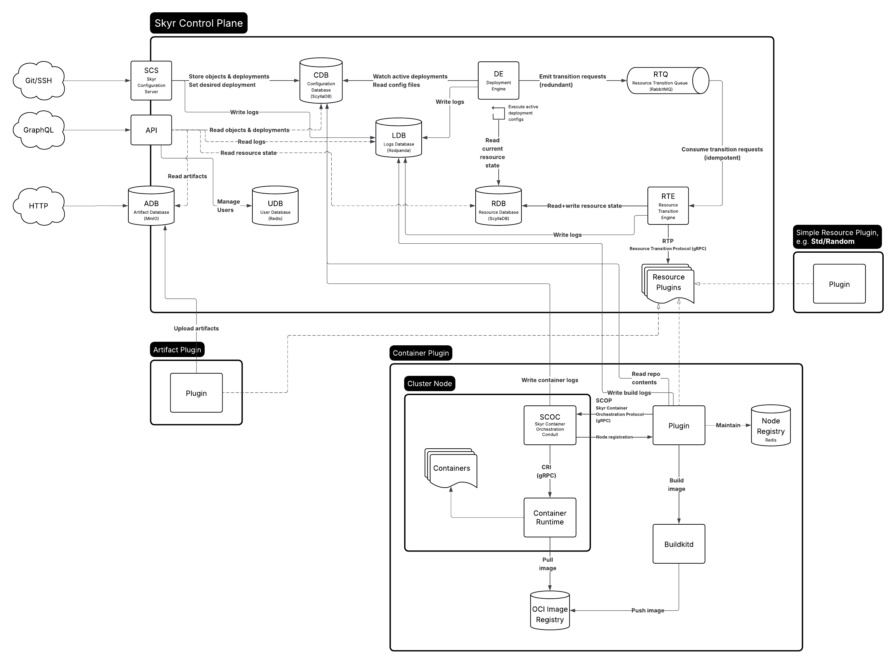

# Skyr

Skyr is a Git-native infrastructure orchestrator. You define your infrastructure in code using the [Skyr Configuration Language (SCL)](docs/scl/index.md), push to Skyr's Git server, and your resources are created, updated, and destroyed automatically.

For end-user documentation, see [docs/](docs/index.md).

## Architecture



Skyr is composed of several services and libraries that work together:

1. A user pushes configuration to the **[SCS](crates/scs/)** (Skyr Configuration Server) via Git over SSH.
2. SCS stores Git objects and deployment metadata in the **[CDB](crates/cdb/)** (Configuration Database, backed by ScyllaDB/Cassandra).
3. The **[DE](crates/de/)** (Deployment Engine) watches for active deployments, compiles their SCL configuration using **[SCLC](crates/sclc/)**, and emits transition requests to the **[RTQ](crates/rtq/)** (Resource Transition Queue, backed by RabbitMQ).
4. The **[RTE](crates/rte/)** (Resource Transition Engine) consumes transition messages and invokes **resource plugins** via the **[RTP](crates/rtp/)** protocol (gRPC).
5. Plugins perform the actual resource operations (create/update/delete) and report outputs back. The RTE persists resource state in the **[RDB](crates/rdb/)** (Resource Database, backed by ScyllaDB/Cassandra).
6. The **[API](crates/api/)** service exposes a GraphQL endpoint for user management, deployment status, logs, and artifacts.

Supporting infrastructure:

- **[UDB](crates/udb/)** — Redis-backed user database for accounts, SSH keys, and bearer tokens.
- **[ADB](crates/adb/)** — S3-backed artifact storage (MinIO in development).
- **[LDB](crates/ldb/)** — Kafka-backed structured log database (Redpanda in development).
- **[SCOC](crates/scoc/)** — Container Orchestrator Conduit, a CRI client that communicates with containerd on cluster nodes.
- **[SCOP](crates/scop/)** — Container Orchestrator Protocol, bidirectional gRPC streaming between the container plugin and conduit nodes.

### Namespace Hierarchy

Skyr uses a four-level namespace hierarchy to identify infrastructure:

| Level | Description | Example |
|-------|-------------|---------|
| **Organization** | Top-level namespace (user's username) | `alice` |
| **Repository** | Codebase name | `my-app` |
| **Environment** | Instance of the resource DAG (Git branch or tag) | `main`, `tag:v1.0` |
| **Deployment** | Revision of an environment (Git commit hash) | `a10fb43f...` |

Qualified identifiers (QIDs) combine these levels: `alice/my_app::main@a10fb43f...`

Separators: `/` (org/repo), `::` (repo::env), `@` (env@deploy). See [IDs](crates/ids/) for the full type system.

### Deployment Lifecycle

When a user pushes a commit, the deployment goes through these states:

- **Desired** — actively rolling out, creating and adopting resources.
- **Lingering** — superseded by a newer deployment, waiting for the new one to take over shared resources.
- **Undesired** — tearing down resources that were not adopted by the new deployment.
- **Down** — fully cleaned up, no longer active.

See [Deployments](docs/deployments.md) for the full lifecycle description.

### Resource Transitions

The RTQ carries four message types:

| Message | Purpose |
|---------|---------|
| **Create** | Create a new resource |
| **Restore** | Re-apply desired state to a drifted resource |
| **Adopt** | Transfer ownership of a shared resource between deployments |
| **Destroy** | Delete a resource that is no longer needed |

## Crates

### Services

| Crate | Description |
|-------|-------------|
| [api](crates/api/) | GraphQL API service |
| [scs](crates/scs/) | Git-over-SSH configuration server |
| [de](crates/de/) | Deployment engine daemon |
| [rte](crates/rte/) | Resource transition engine daemon |
| [cli](crates/cli/) | CLI/REPL binary (`skyr`) |

### Data Layer

| Crate | Backing Store | Description |
|-------|---------------|-------------|
| [cdb](crates/cdb/) | ScyllaDB | Configuration database (Git objects, deployments) |
| [udb](crates/udb/) | Redis | User database (accounts, SSH keys, tokens) |
| [rdb](crates/rdb/) | ScyllaDB | Resource database (inputs, outputs, dependencies) |
| [adb](crates/adb/) | S3 / MinIO | Artifact storage |
| [ldb](crates/ldb/) | Kafka / Redpanda | Structured log database |

### Protocol Layer

| Crate | Transport | Description |
|-------|-----------|-------------|
| [rtq](crates/rtq/) | RabbitMQ | Resource transition queue |
| [rtp](crates/rtp/) | gRPC | Resource transition plugin protocol |
| [scop](crates/scop/) | gRPC | Container orchestrator protocol |

### Compiler

| Crate | Description |
|-------|-------------|
| [sclc](crates/sclc/) | SCL compiler and runtime (lexer, parser, type checker, evaluator) |

### Shared Libraries

| Crate | Description |
|-------|-------------|
| [ids](crates/ids/) | Typed identifiers for the namespace hierarchy (OrgId, RepoQid, EnvironmentQid, DeploymentQid) |

### Plugins

| Crate | Resource Types | Description |
|-------|---------------|-------------|
| [plugin_std_random](crates/plugin_std_random/) | `Std/Random.Int` | Random number generation |
| [plugin_std_artifact](crates/plugin_std_artifact/) | `Std/Artifact.File` | Artifact file storage via ADB |
| [plugin_std_container](crates/plugin_std_container/) | `Std/Container.Image`, `Pod`, `Pod.Container` | Container management via SCOP/SCOC |

### Container Infrastructure

| Crate | Description |
|-------|-------------|
| [scoc](crates/scoc/) | Container orchestrator conduit (CRI client for containerd) |

## Running Locally

Infrastructure services are defined in `podman-compose.yml`:

| Service | Port(s) | Purpose |
|---------|---------|---------|
| ScyllaDB | 9042 | Configuration and resource databases |
| RabbitMQ | 5672, 15672 | Resource transition queue |
| Redis | 6379 | User database and node registry |
| Redpanda | 9092 | Log database |
| MinIO | 9000, 9001 | Artifact storage |
| OCI Registry | 5000 | Container image registry |
| BuildKit | 1234 | Container image builds |

Application services:

| Service | Port | Description |
|---------|------|-------------|
| api | 8080 | GraphQL API |
| scs | 2222 | SSH Git server |
| de | — | Deployment engine |
| rte-{0,1,2} | — | Resource transition engine workers |
| plugin-std-random | 50051 | Random plugin |
| plugin-std-artifact | 50052 | Artifact plugin |
| plugin-std-container | 50053 | Container plugin |
| scoc-{1,2,3} | — | Container orchestrator conduit nodes |

To start everything:

```sh
make up # builds images and starts podman compose detached
make down # podman compose down
```

This requires building the `skyr:latest` image first.

For individual services, use `cargo run -p <crate> -- daemon` with appropriate flags.

## Development

The project uses Nix for development dependencies. Enter the dev shell:

```sh
nix develop
```

Build and test:

```sh
cargo build
cargo test
```
